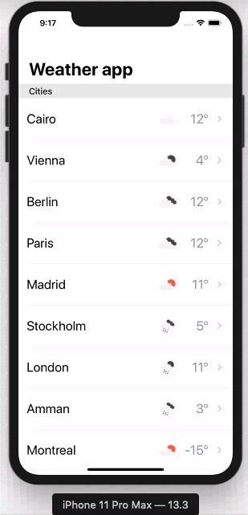
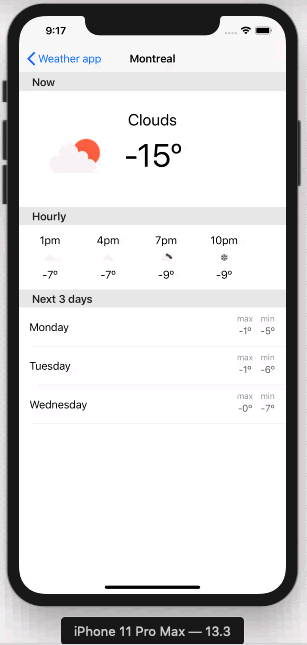

# Weather-For-Three-Days-Reactor
[](https://www.codacy.com/manual/menabebawy/Weather-For-Three-Days-Reactor?utm_source=github.com&amp;utm_medium=referral&amp;utm_content=menabebawy/Weather-For-Three-Days-Reactor&amp;utm_campaign=Badge_Grade)
[](LICENSE)
[]([https://swift.org/)
[](POD)  

It allows you to fetch current weather for some static cities around the world and get today forecasts along the next three coming days using [open weather api](https://openweathermap.org/api).
Using [RxSwift](https://github.com/ReactiveX/RxSwift), [Reactor](https://github.com/ReactorKit/ReactorKit)

 

## Getting Started

### Prerequisites

- Xcode 11.3
- iOS13


## Usage

 ```
 pod install 
 ```
 then run :rocket::rocket:

## Features

- Fetch current weather
- Fetch today forecasts
- Fetch next three coming daya


## Networking

Use [Endpoints](https://github.com/tailoredmedia/Endpoints)

## Design patterns

- [Reactor](https://github.com/ReactorKit/ReactorKit)
- Coordinator
- Command

## License

This project is licensed under the MIT License

